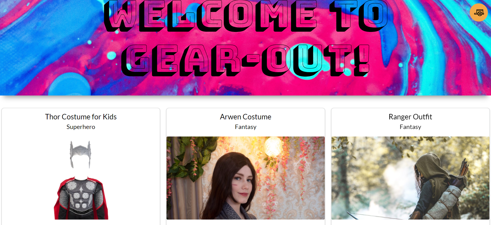
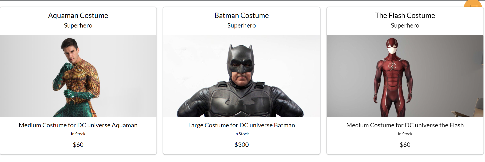
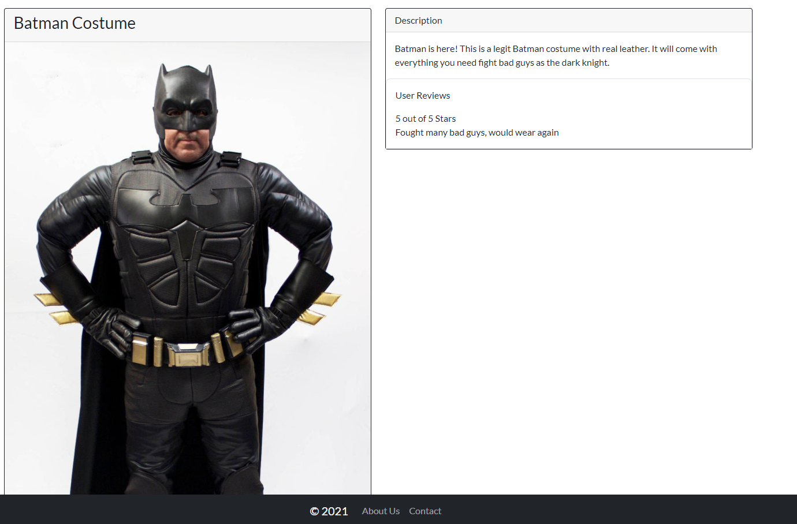
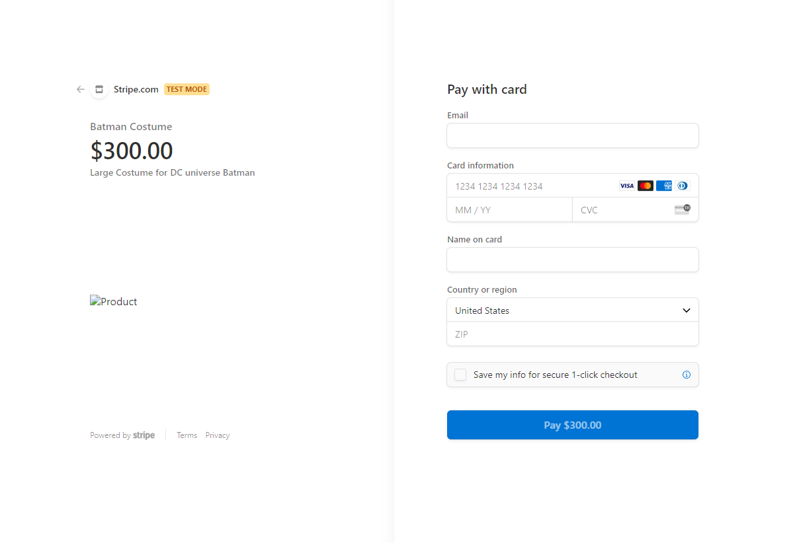

# Gear Out

## Table of contents

1. [Description](#Description)
2. [Installation](#Instructions)
3. [Usage](#Usage)
4. [License](#License)
5. [Contribution](#Contribution)
6. [Tests](#Tests)
7. [Questions](#Questions)

## Description

An E-Commerce Portal meant to provide access to high quality costumes at an affordable rate. Have a costume party coming up, but the only options are low quality deparment store costumes? You could invest a lot of money into a professional grade costume, or you could rent one from one of our approved vendors. Ready to go all out with Gear Out?

## Installation

No installation necessary if accessing this from the customer URL. As of this iteration you will only need to create a username and password to search our database.

### Tech Used

- React
- Bootstrap
- JavaScript
- MongoDB
- Mongoose
- GraphQL
- Redux
- Stripe

## Usage

1. Create an account by providing your username and password.
2. Once you are logged in, you are ready to shop from our authorized vendors. Maybe one of our featured items catches your eye

3. Perhaps a helpful category search can narrow down what you are looking for

4. Each item card will give you the information you need to select your next outfit

5. Check out through our seemless Stripe integration

6. Manage your returns through your user profile

---SCREENSHOT HERE

## License

MIT 

## Contribution

Forking and Feedback always welcome

## Tests

GraphQL sandbox can be accessed via localhost 3001/Graphql. Make sure queries and mutations perform as expected should you decide to make modifications.

## Questions

Got questions, or are interested in collaborating?

Github:

https://github.com/PRicoSaint
https://github.com/radams017
https://github.com/jcpickens0215
https://github.com/lelandcypress
